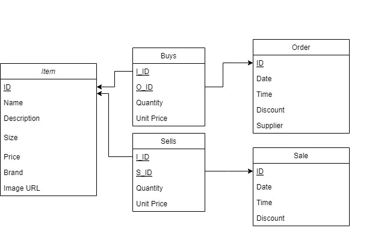
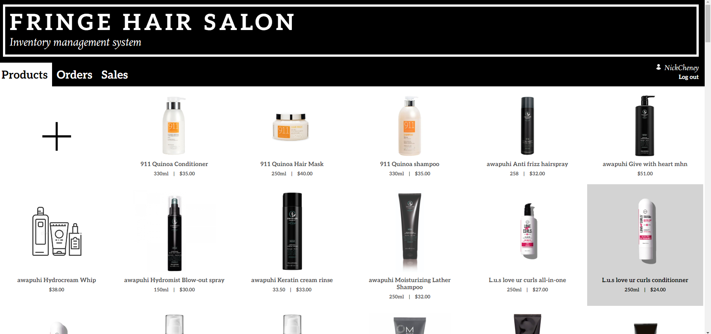
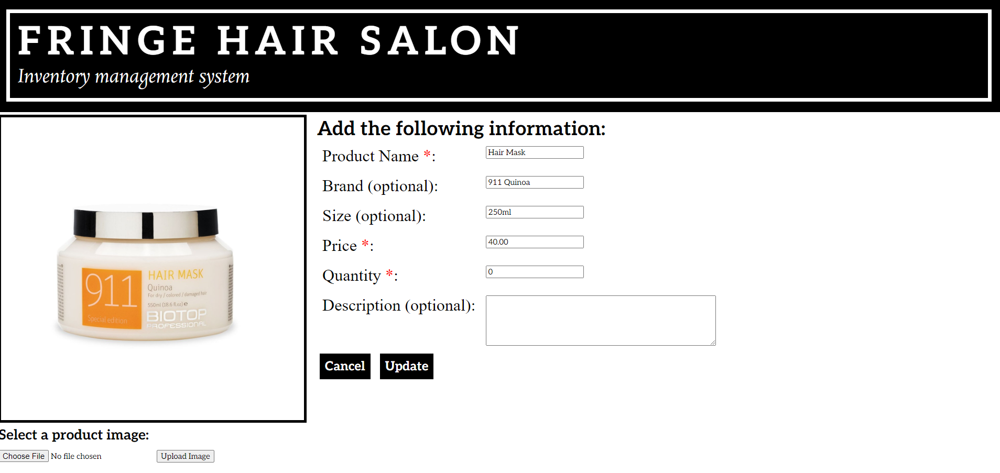
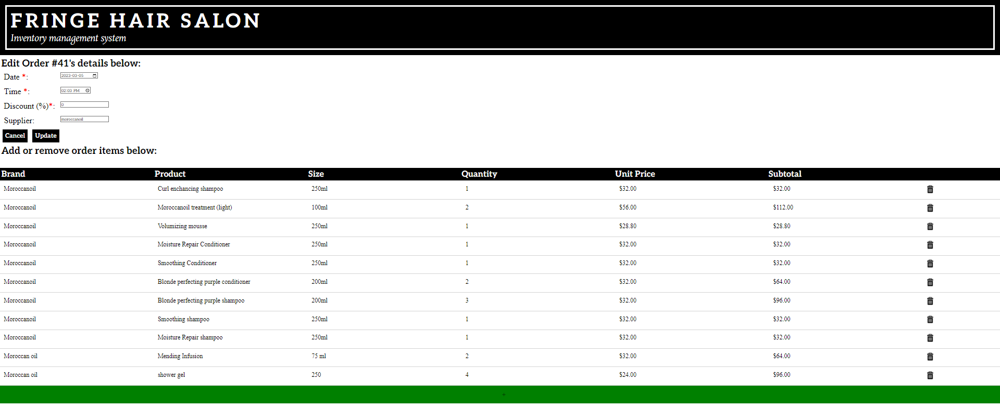

# Salon-Inventory-Management
Source code for a user-friendly LAMP-based web application to manage hair product inventory, purchases and sales at Fringe Hair Salon, Chatham, ON. 

## Background
This project was inspired by the final deliverable of an [Into to Database Management class](https://www.cs.queensu.ca/undergraduate/courses/CISC-332) I took at Queen's, creating a locally-hosted full-stack web app for a hypothetical Animal Rescue Organization with [Apache XAMPP](https://www.apachefriends.org/). With bare-minimum styling and functionality, it definitely had room for improvement, so when family friends expressed desire for a solution for their business with similar user requirements, I leapt at the opportunity.

## Design
User requirements specified the app would need CRUD operations for hair products, orders and sales of said products. Translating an initial entity-relationship diagram to a relational schema, I was left with this:

As a student with limited experience with cloud serving solutions and a pre-owned Raspberry Pi board without enough RAM for Mincecraft server hosting, I followed [this handy guide](https://www.digitalocean.com/community/tutorials/how-to-install-linux-apache-mysql-php-lamp-stack-ubuntu-18-04) to set up Apache HTTP server, MariaDB (MySQL Fork) and PHP. With some port-forwarding and a cheap DNS, the Fringe Hair Salon Inventory Management System went live!

## Appearance 
After logging in, the app lands users on the products tab.

Clicking on a product allows the user to view and/or edit item fields...

and likewise a tabular layout to edit order/sale details.

I tried to keep the interface clean and user-friendly with large iconography and text, on-hover highlighted buttons and specific errors for mandatory form fields.
Mention security with: 
login client,
Password SHA, 
PDO and prepared statements to
- prevent SQL injection attacks

# Lessons learned

# Next Steps
